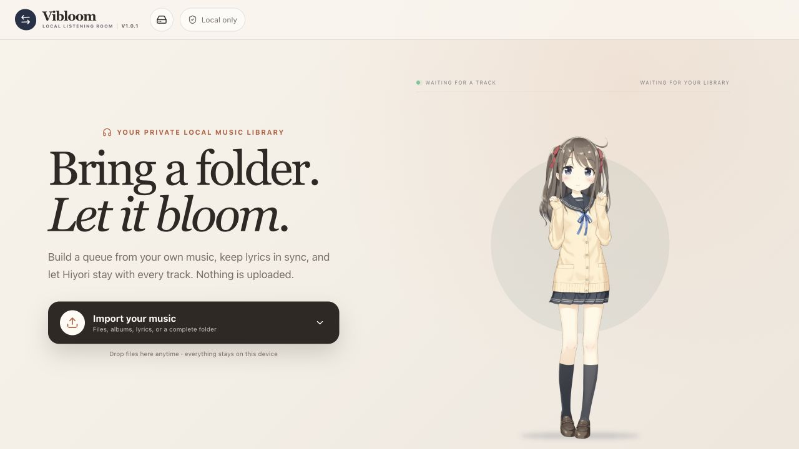
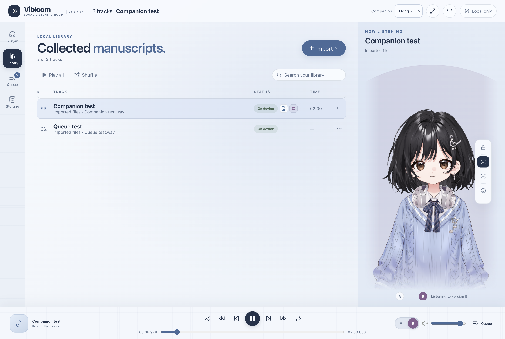
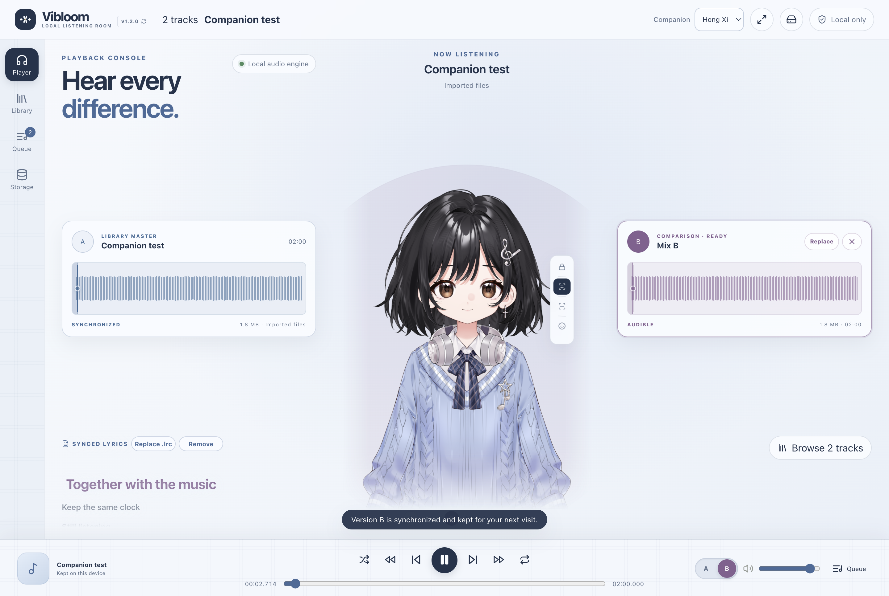
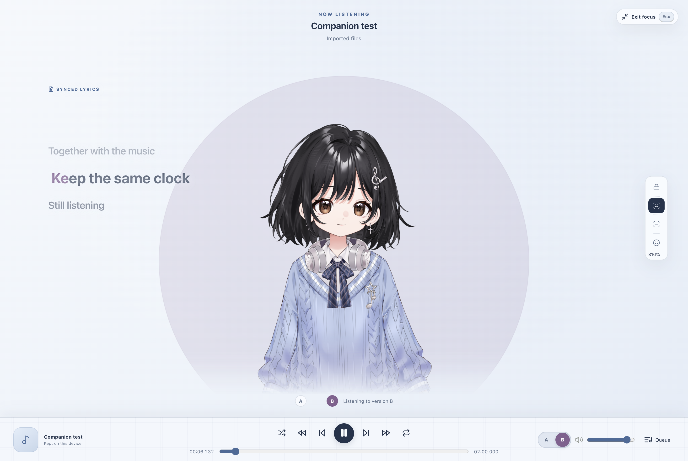
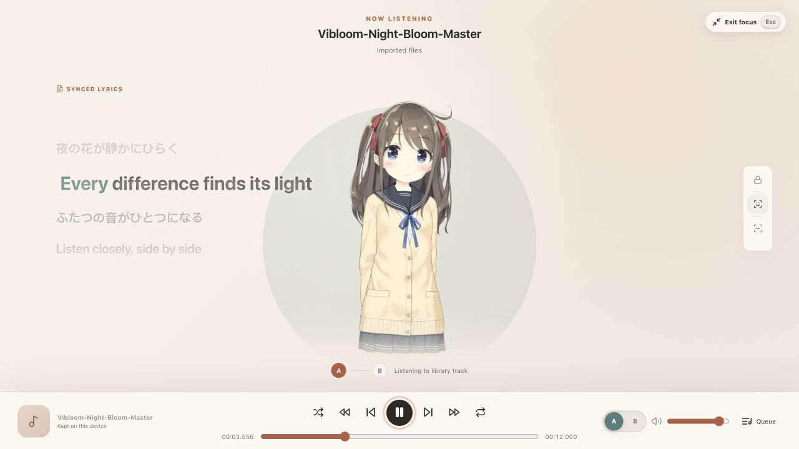

# Vibloom

Your music library, brought to life.

Vibloom is a private, local-first music player for the web, Windows, and macOS. Bring a song, a whole album, or a folder; build a queue; add synchronized lyrics; compare two versions of a mix; and listen with Hiyori as a rhythm-aware Live2D companion.

[Open Vibloom on the web](https://wedoso.github.io/Vibloom/) · [Download the desktop app](https://github.com/wedoso/Vibloom/releases/latest)



## Everything stays yours

Vibloom has no account, server upload, analytics, or cloud music locker. Audio and lyrics are read and processed locally in the browser or desktop app.

New music is kept on this device by default so reopening the tab does not normally require reconnecting your files. You can pause automatic caching, remove individual cached copies, clear all cached audio while keeping the library, or reset Vibloom completely from **Storage**.

Browser storage can still be cleared by private-browsing rules, site-data cleanup, or operating-system pressure. Vibloom always shows which tracks are available, stored on-device, or need reconnection.

## A complete local player



- Import multiple audio files, matching `.lrc` lyrics, or a complete folder.
- Play in order, shuffle without repeats, repeat one track, or repeat the queue.
- Reorder the queue and choose **Play next** without changing the library.
- Search your collection and resume the last track and position after reopening.
- Use `Space` to play or pause, arrow keys to seek five seconds, and `F` to enter or leave Focus mode.
- Use Director for automatic phrase-level framing, Portrait for an upper-body shot, or Wide for a full-body view.
- Use the mouse wheel for manual framing up to 400%. Every camera mode adapts to the available stage, protects the title area, and applies a soft edge fade when close framing reaches a boundary.

## Hear the difference



The current library track is always Version A. Add or drop a Version B only when you need it; Vibloom then shows two color-matched waveforms on one shared timeline.

- A and B start from the same audio clock and stay sample-aligned.
- Use the visible A/B controls or press `1` / `2` (`A` / `B`) to switch.
- Replace or remove Version B at any time.
- Different-length files are called out clearly; the shared timeline follows the longer version and identifies a source that has already ended.
- Version B is cached with its Version A track and receives a visible tag in the library.

## Focus on the music



Press `F` for a distraction-free stage. Focus mode removes the waveform cards while keeping the same audio clock, playhead, camera, synchronized lyrics, compact A/B selector, and single bottom transport. The stage now reaches the transport instead of leaving a large empty band below Hiyori. Press `F` again or `Esc` to leave.

## Synchronized lyrics



Attach, replace, or remove an `.lrc` file from the current song or its library menu. Lyrics scroll with playback and use the audible source color: green for Version A, rose for Version B. UTF-8 and BOM-marked UTF-16 files are supported, including offsets, repeated timestamps, and multilingual lines.

## Desktop and browser support

The Windows and macOS apps use the same React renderer and product code as the web version; Electron adds only the native window, security boundary, and packaging layer. Each build displays its version in the header so users can compare it with the [latest release](https://github.com/wedoso/Vibloom/releases/latest).

On macOS, closing the player window hides it while audio keeps playing. Click Vibloom in the Dock to bring the window back, or press `Command-Q` when you want to quit the app and stop playback completely.

The web version targets current Safari, Chrome, and Firefox on desktop. Folder drag-and-drop depends on browser support; the visible folder picker is always available as a fallback.

Common MP3, WAV, M4A/AAC, FLAC, OGG, Opus, WebM Audio, and AIFF files are accepted when the browser can decode them. Individual files larger than 300 MB are rejected to protect the tab.

## Quick start

1. Open Vibloom and choose **Import your music**.
2. Pick files or a folder. Include same-named `.lrc` files if you have them.
3. Choose a song, **Play all**, or **Shuffle**.
4. Open **Queue** to change what plays next.
5. Choose **Add version B** when you want an exact mix comparison.
6. Open **Storage** whenever you want to review or clear local copies.

## For contributors

Vibloom is a static React/Vite app and can be hosted without a backend. The Electron desktop shell loads that same production renderer rather than maintaining a separate UI implementation.

```bash
git clone https://github.com/wedoso/Vibloom.git
cd Vibloom
npm ci
npm run dev
```

Run the complete validation suite with `npm run check`. A production build is emitted to `dist/` with `npm run build`. GitHub Pages deployment is configured in [deploy-pages.yml](.github/workflows/deploy-pages.yml).

The same renderer can run as a Windows or macOS desktop application:

```bash
npm run desktop:dev
npm run desktop:smoke
```

Installer builds and the GitHub Actions release workflow are documented in [the desktop build guide](docs/desktop.md). `package.json` is the single version source for the web header, desktop runtime, and installer metadata. Release Please prepares future version updates on `main`; merging its release PR creates the Git tag and GitHub Release, then the desktop workflow builds Windows plus Apple Silicon and Intel macOS installers. The two macOS architectures run in parallel before their signed and notarized artifacts are attached to the release. Download the current version from the [Releases page](https://github.com/wedoso/Vibloom/releases/latest).

Detailed implementation contracts live in [the player specification](docs/library-player.md) and [architecture notes](docs/architecture.md).

## License

Vibloom source code is available under the [MIT License](LICENSE).

Hiyori Momose is a Live2D sample model. Its bundled notice is available at [LICENSE-HIYORI.txt](public/live2d/hiyori/LICENSE-HIYORI.txt); the model and Cubism runtime remain subject to Live2D's applicable licenses and terms.
