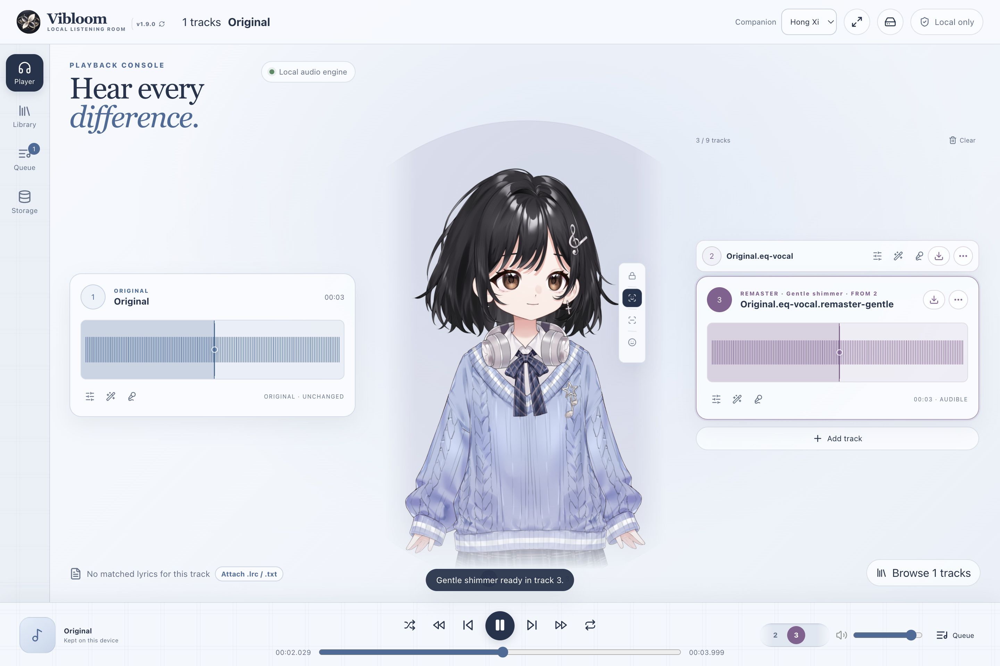
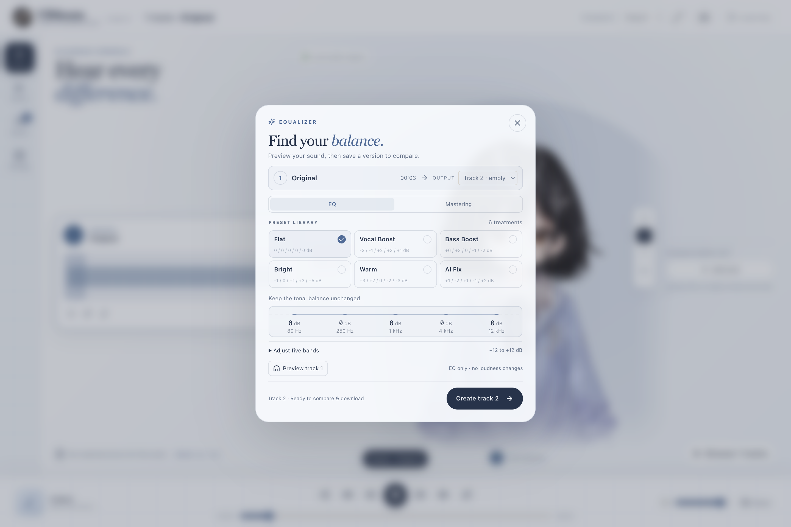
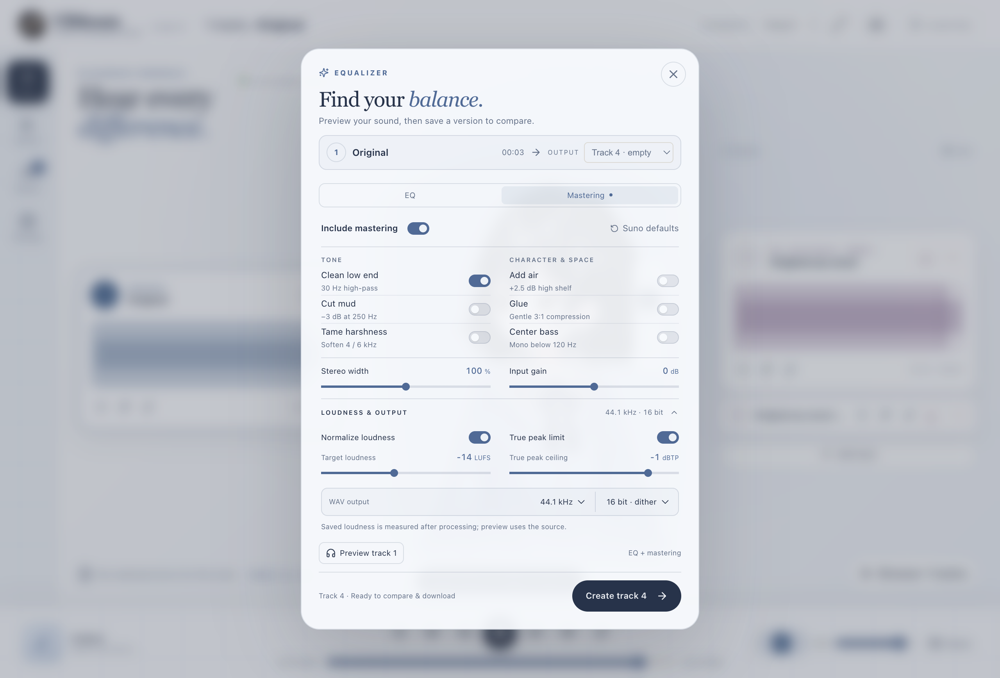

#  Vibloom

Your music library, brought to life.

A private music player for the web, macOS, and Windows, with synchronized comparison of up to nine tracks, timed lyrics, and Live2D companions. No account, uploads, or analytics; your music stays on your device.

[Open the web player](https://wedoso.github.io/Vibloom/) · [Download the desktop app](https://github.com/wedoso/Vibloom/releases/latest)


## Features

- **Local library:** choose or drag in audio files and nested folders, search, reorder the queue, shuffle, repeat, and resume your last position. Music is cached by default; manage local copies in **Storage**.
- **Virtual albums:** create collections with your own cover images; the playback bar shows the playing album’s artwork. Select existing songs, drag library songs onto an album, or import new music directly into it. Drag rows within an album to reorder; the saved order also drives Play all. Row menus provide move-up/down controls.
- **Audio Repair:** open the wand on any track to browse 17 deshimmer presets. Clean up shimmer, noise and ringing, or choose a delivery target; send the result to another track and download 24-bit WAV.
- **EQ presets:** Flat, Vocal Boost, Bass Boost, Bright, Warm and AI Fix reproduce Suno-Song-Remaster’s five-band EQ. EQ and Audio Repair can be chained: track 1 → EQ → track 2 → Audio Repair → track 3. All processing stays on-device.
- **Nine-track comparison:** keep the original on the left and up to eight versions on the right. The selected comparison expands, and others become compact cards with animated transitions. Switch with keys **1–9** or the original/recent-version switch, compare on one audio clock, download each version, and keep it for your next visit. Returning to track 1 keeps the last comparison expanded. **Clear** removes all comparison versions and releases their audio resources. Cold versions load while the current audio keeps playing; collapsed waveforms unmount after the transition.
- **[Lyrics](docs/assets/lyrics-timing.png):** edit TXT/LRC text, insert or delete lines, and timestamp lyrics. Download TXT or synced LRC files. Same-named lyric files match during import or a later lyric-only drop; ambiguous matches require manual attachment.
- **Headset controls:** system play/pause and seek commands share the player's transport, preserving position and synchronized comparisons. AirPods ear detection depends on device settings and OS/browser support; physical AirPods testing is still pending.
- **Live2D companions:** switch smoothly between Hong Xi and Hiyori; both respond to **Say hello**. Enjoy gestures, gaze, camera controls, and Focus mode. **Prepare vocal lip sync** with the microphone on each Player card or enter **[Prepare lip sync](docs/assets/library-selection.png)** in **[Library](docs/assets/library.png)** to select songs; both views share background jobs. Card progress follows the perimeter with visible download, model-loading and analysis phases; newly prepared vocals automatically enable singing for that source. Click the microphone to toggle it afterward. Mouth opening follows vocal energy, with sustained, estimated vowel shapes; detail depends on the model’s mouth rig. First use downloads a 172 MiB model; results stay on-device.
- **Desktop updates:** click the version beside the logo to check for updates. On macOS, closing the window keeps music playing; `Command-Q` quits.



## Quick start

1. Choose **Import your music**, then select files or a folder. Include matching `.lrc` or `.txt` files if available.
2. Play a song, arrange **Queue**, or **Add track** to compare another mix (up to nine tracks total).
3. Click the EQ sliders or Audio Repair wand on any card. The sliders open **EQ | Mastering**: choose a preset, optionally enable **Preview track** to hear changes immediately, and use **Hear original** for bypass. The preview status light shows **Preparing → Applying → Applied**, or **Bypassed** while hearing the original. Applied follows the audio output clock; preview does not start paused playback. Choose an **Output track**, then **Create track**. When ready, select the result with its card or number key. Processing completion keeps your current track playing. Use the result as the source for another treatment, or download its WAV.
4. In **Library**, choose **New album**, name it, choose a cover, and select songs. Open **Albums** to browse covers. Use **Edit album** to replace or remove its cover later. Drag a song over the **Albums** tab to reveal its cards, then drop onto a card to add it. Imports into the selected album join it automatically.
5. For TXT lyrics, choose **Timestamp lyrics**; for LRC, choose **Edit timing**. Select a line to edit its text or insert/delete rows. Press `T` to timestamp and advance, or `S` to overwrite the selected time without advancing. `Command/Ctrl + Enter` also overwrites while typing. Outside text fields, `Space` plays/pauses and `Z` undoes. Drafts are saved with the track; export with **Download .txt** or **Save & download .lrc**.

| Shortcut | Action |
| --- | --- |
| `Space` | Play / pause |
| `←` / `→` | Seek five seconds |
| `1`–`9` | Switch to the numbered track |
| `F` / `Esc` | Toggle / leave Focus mode |

## EQ, Audio Repair and Mastering

Browse the preset library by **Shimmer**, **Full stack**, **Resonance**, **Targeted**, or **Delivery**. Each preset has a description; **Default shimmer** is the original starting recipe, while **Full stack · conservative** combines shimmer cleanup, light denoise and gentle resonance reduction. All 17 presets remain available under **All presets**, including Bypass for a reference copy.





Choose **Keep listening**, close the panel, or press `Esc` while processing to return to playback. Progress follows the source card’s border; its tool button reopens the panel to check or cancel. The result appears in the selected output slot. Occupied slots are marked **replace**, and the apply button names the track being replaced; failure and cancellation preserve its previous audio. Original track 1 is retained. Each comparison’s download icon saves its WAV (EQ/Audio Repair: PCM24; full mastering: chosen 16-bit with TPDF dither or 24-bit), and its more menu replaces or removes that version without renumbering the others.

EQ-only preserves the source’s decoded sample rate, frame count and channel count. Each source version owns its settings draft; opening a rendered version starts a fresh Flat treatment, since earlier processing is already baked into its audio. The **Mastering** tab adds Clean Low End, Cut Mud, Tame Harshness, Add Air, Glue, stereo width, Center Bass, input gain, integrated-LUFS normalization, final limiting and 4× peak clipping. **Suno defaults** explicitly loads the reference configuration, including 44.1 kHz / 16-bit output.

Live preview is temporary and source-specific; closing, creating or switching tracks restores the user's selection and play/pause intent. Export measures the processed song and uses the reference's separate limiting / oversampling path. Independent checks compare preview and export paths with their pinned upstream implementations.

Web and desktop share the same processing implementation. Audio Repair runs in a TypeScript/C++ WASM Worker; EQ and mastering use native Web Audio. Heavy exports and vocal preparation share a queue, while live preview uses the existing playback clock. The decoded comparison cache targets 256 MiB; decoder/render scratch and other app resources are additional. Input supports mono/stereo at 8–96 kHz, up to 12 minutes and 128 MiB of decoded PCM. See [audio processing](docs/audio-processing.md) for settings, processing boundaries and resource limits.

Common MP3, WAV, M4A/AAC, FLAC, OGG, Opus, WebM Audio, and AIFF files are accepted when supported by the runtime's decoder, up to 300 MB per file. Lyrics support UTF-8 and BOM-marked UTF-16. Browser storage may be cleared by private browsing, site-data cleanup, or storage pressure; reconnect source files when prompted.

Album covers can be changed through **Edit album**. The playback bar follows the song’s album, even when browsing another collection. Companion, output and album menus share the active theme and support keyboard navigation. Focus mode keeps comparison switching independent of the companion’s gaze.

## Development

Requires Node.js 22.13 or later.

```bash
git clone https://github.com/wedoso/Vibloom.git
cd Vibloom
npm ci
npm run dev             # Web development
npm run desktop:dev     # Electron development
npm run check           # Lint, tests, and production build
```

`npm run build` writes the static site to `dist/`. Use
`npm run desktop:smoke:library` or `npm run desktop:smoke:multi` for the affected
workflows, and `npm run check:eq` / `npm run check:mastering` for independent
processing checks. Generated reports, recordings, logs and design-tool files stay
in ignored local directories.

See [desktop builds and releases](docs/desktop.md),
[player behavior](docs/library-player.md), [audio processing](docs/audio-processing.md),
and [architecture](docs/architecture.md) for maintained documentation.
Version history is in [CHANGELOG.md](CHANGELOG.md).

## License

Source code: [MIT](LICENSE). The remaster port follows [TheApeMachine/deshimmer](https://github.com/TheApeMachine/deshimmer); its FFT and loudness components retain their third-party notices, including BSD-3-Clause ducc and MIT pyloudnorm. EQ presets/filter setup and the independent encoder oracle follow [SUP3RMASS1VE/Suno-Song-Remaster](https://github.com/SUP3RMASS1VE/Suno-Song-Remaster), declared ISC upstream; see [EQ source notice](public/eq-NOTICES.txt). Bundled native-runtime notices are in [remaster-NOTICES.txt](public/remaster-NOTICES.txt). Hiyori and the Cubism runtime retain their applicable Live2D terms; see [Hiyori's notice](public/live2d/hiyori/LICENSE-HIYORI.txt) and the [MotionSync runtime license](public/live2d/motionsync/LICENSE.md).

### Hong Xi Live2D model — commercial use requires permission

The Hong Xi Live2D model and its associated artwork, textures, expressions, and model assets are **not covered by the MIT source-code license**. **Commercial use requires prior permission from the rights holder.** Including these assets in this repository or in Vibloom does not grant permission to sell them, include them in a commercial product or service, or otherwise use them commercially. See the [model's usage notice](public/live2d/hong-xi/NOTICE.md).
