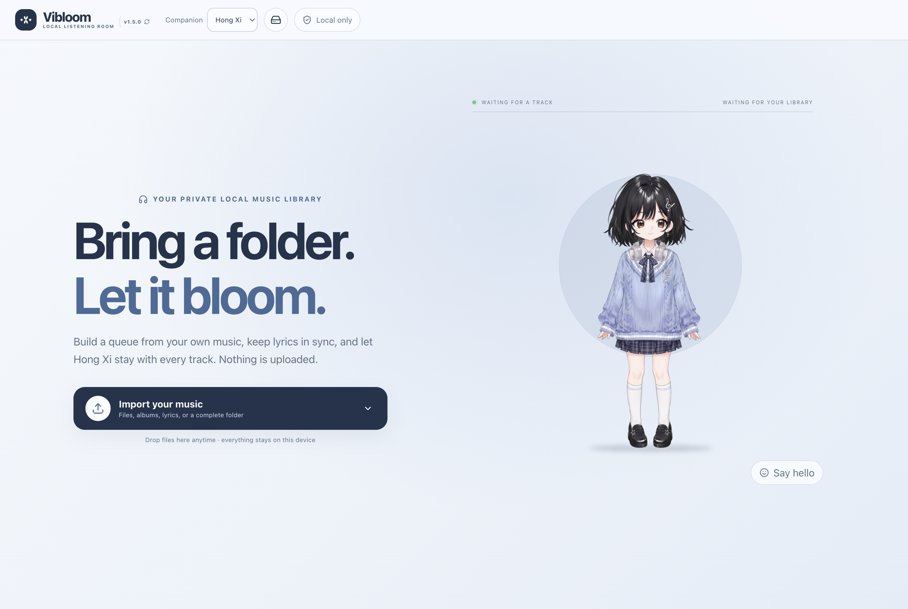
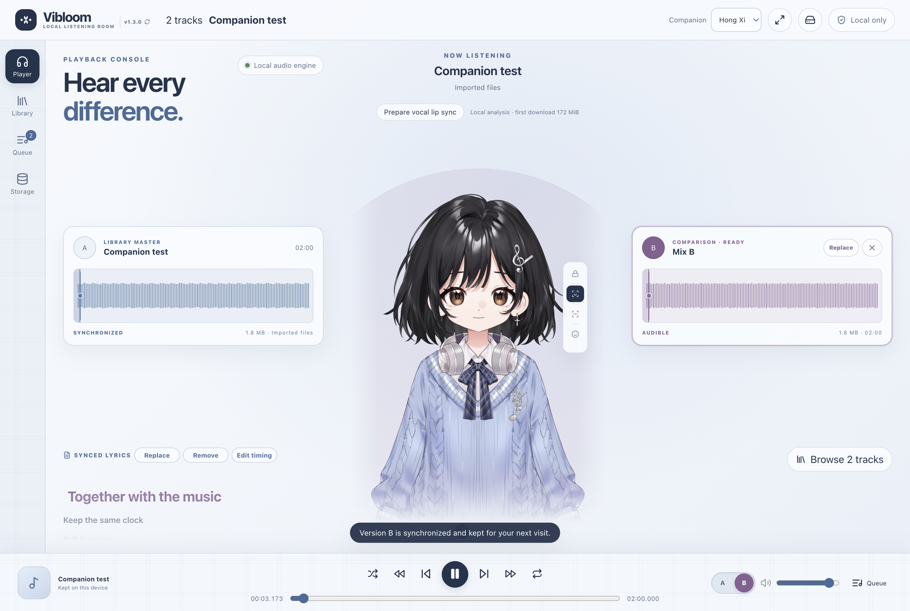

# Vibloom

Your music library, brought to life.

A private music player for the web, macOS, and Windows, with synchronized A/B comparison, timed lyrics, and Live2D companions. No account, uploads, or analytics; your music stays on your device.

[Open the web player](https://wedoso.github.io/Vibloom/) · [Download the desktop app](https://github.com/wedoso/Vibloom/releases/latest)



## Features

- **Local library:** import audio files or folders, search, reorder the queue, shuffle, repeat, and resume your last position. Music is cached by default; manage local copies in **Storage**.
- **A/B comparison:** add a second version, switch instantly on one shared audio clock, and compare waveforms. Both versions can be kept on-device.
- **Lyrics:** attach LRC files for synchronized scrolling, or timestamp plain TXT lyrics and download an LRC file. Same-named lyric files match automatically during import.
- **Headset controls:** system play/pause and seek commands share the player's transport, preserving position and A/B synchronization. AirPods ear detection depends on device settings and OS/browser support; physical AirPods testing is still pending.
- **Live2D companions:** Hong Xi is the default; switch to Hiyori in the header. Both respond to music and pointer movement, with camera controls and Focus mode. Your choice is saved.
- **Desktop updates:** click the version beside the logo to check for updates. On macOS, closing the window keeps music playing; `Command-Q` quits.



## Quick start

1. Choose **Import your music**, then select files or a folder. Include matching `.lrc` or `.txt` files if available.
2. Play a song, arrange **Queue**, or add Version B to compare a second mix.
3. For TXT lyrics, choose **Timestamp lyrics**. Press `T` as each line starts, `Space` to play/pause, and `Z` to undo. Select a line to correct it; drafts are saved with the track. Finish with **Save & download .lrc**.

| Shortcut | Action |
| --- | --- |
| `Space` | Play / pause |
| `←` / `→` | Seek five seconds |
| `1` / `2` or `A` / `B` | Switch comparison source |
| `F` / `Esc` | Toggle / leave Focus mode |

Common MP3, WAV, M4A/AAC, FLAC, OGG, Opus, WebM Audio, and AIFF files are accepted when supported by the runtime's decoder, up to 300 MB per file. Lyrics support UTF-8 and BOM-marked UTF-16. Browser storage may be cleared by private browsing, site-data cleanup, or storage pressure; reconnect source files when prompted.

## Development

Requires Node.js 22.13 or later.

```bash
git clone https://github.com/wedoso/Vibloom.git
cd Vibloom
npm ci
npm run dev             # Web development
npm run desktop:dev     # Electron development
npm run check           # Lint, tests, and production build
```

`npm run build` writes the static site to `dist/`. Desktop smoke tests use isolated profiles:

```bash
npm run desktop:smoke
npm run desktop:smoke:lyrics
npm run desktop:smoke:media
npm run desktop:smoke:companions
```

See [desktop builds and releases](docs/desktop.md), [player behavior](docs/library-player.md), and [architecture](docs/architecture.md) for details. Version history is in [CHANGELOG.md](CHANGELOG.md).

## License

Source code: [MIT](LICENSE). Hiyori and the Cubism runtime retain their applicable Live2D terms; see [Hiyori's notice](public/live2d/hiyori/LICENSE-HIYORI.txt). Hong Xi artwork is not covered by the source-code license; no separate redistribution license was included with its supplied export.
