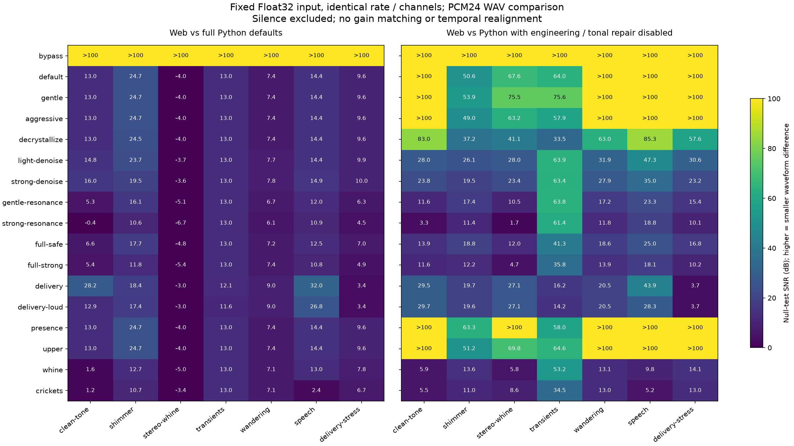
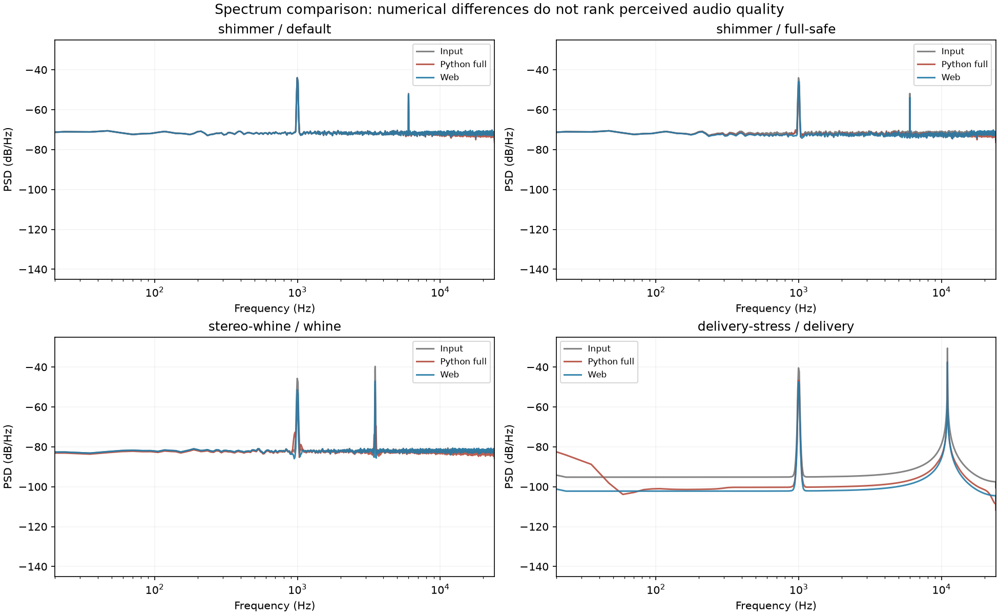

# Python / Web deshimmer 一致性对照

> 历史基线：本文保存 `web-deshimmer-1` 的对照结果。修复后的 v2 结果见 [等价输出报告](remaster-equivalence.zh-CN.md)。

日期：2026-10-07。Web 引擎：`web-deshimmer-1`，分支 `codex/web-deshimmer`。Python 固定版本：[`fea2cca81da613ec8a3aca4962a359e060eab9d9`](https://github.com/TheApeMachine/deshimmer/tree/fea2cca81da613ec8a3aca4962a359e060eab9d9)。

**结论：目前输出不一致，不能视为 Python 默认流程的等价实现。** Bypass 在 8 组输入上符合 PCM24 容差；完整 Python 流程与其余 16 个 Web 预设，在 7 个非静音输入上都未达到本文的“近似一致”标准。长度、采样率、通道数和有限值检查全部通过。差异主要来自处理阶段、分支和参数，超出一般浮点或编码误差。

这是数值一致性检查，不能据此断定哪一版更好听。素材包括合成信号与现有的真实语音片段，未做真实歌曲盲听。此次没有修改生产 DSP 或预设，保留了上一版的测量基线。

## 比较方法

两版读取**同一份 little-endian Float32 PCM**，不经过 AudioContext 解码或重采样。每个输入的 SHA-256、帧数、通道数、采样率以及 Web 源文件哈希均保存在 [运行证据](remaster-parity-results.json)。

8 组输入：静音、1 kHz 纯音、噪声床＋6 kHz 窄带尖峰、左右声道音量不同且有 6 个采样点延迟的 3.5 kHz 啸声、瞬态＋静音转噪声、上游 wandering harmonic 素材、仓库中 4 秒真实语音、带 DC 偏置的高峰值高频 burst。覆盖 mono/stereo、44.1/48 kHz、2–4 秒。

每组运行全部 17 个预设，共 136 个 Web 输出；Python 各运行两种模式，共 272 个参考输出：

1. **Full**：从上游 Gradio 新开界面的默认状态应用对应预设，调用原 `process_stft` 和 `master_post`。预设原始值用 AST 读取，参数使用上游 `_build_params` 生成。
2. **Repair-only**：在上述状态中只关闭 `enhance` 和 `tonal_repair`。上游听觉掩蔽、三轮投影、降噪/共振分支以及 Delivery 母带仍保持原样。这个模式用于定位差异，不能替代完整 Python 默认流程。

上游预设是对界面状态的增量修改，会继承上一个预设的部分参数。本次固定为每次从初始默认状态开始；Web 配方是独立快照，因此未比较 Python 界面连续切换预设后的继承行为。

两版均导出 PCM24 WAV，按导出后的采样值对照。Python 使用 soundfile 的量化，Web 使用自己的量化；Bypass 的最大差值约一个 LSB，符合容差，**不代表两版 WAV 字节完全一致**。参考输出没有出现超出 ±1 后被编码截断的采样。

另在沙箱化 Electron 43.3.0 中运行生产构建的真实 Worker：shimmer、stereo-whine、delivery-stress 三组输入 × 全部 17 预设，共 **51 个 WAV 与 Node 对照脚本字节级一致（SHA-256）**。因此 Node 测量覆盖了实际 Web DSP，而非另一套模拟算法。

衡量方式：

- PCM 容差：最大绝对采样差 ≤ `2 / 8388608`，约两个 PCM24 LSB。
- 近似一致：符合 PCM 容差，或同时满足 null-test SNR ≥60 dB、整体响度差 ≤0.1 LU、有效频段能量差 ≤0.1 dB。
- SNR = `20 log10(RMS(Python) / RMS(Web − Python))`，越大表示波形越接近；这是输出之间的残差指标，不是音乐的信噪比。未做增益匹配或时间平移。
- 响度两版统一由 pyloudnorm **DeMan** 滤波器测量；原 Python 归一化调用自身默认滤波器，这本身也有小差异。
- 频段覆盖 20–180、180–1000、1–3k、3–4.2k、4.2–5.1k、5.1–7.2k、7.2–12k、12–20k Hz。参考频段能量低于 −80 dB 时不用于近似判断。
- 峰值统一使用 SciPy `resample_poly` 的 4× 估计，不混用两版各自的峰值计。该估计仍不是广播 true-peak 合规认证。

60 dB 等标准是本次明确规定的工程容差，不是听觉透明性认证；“未通过”不能直接解释为一定可听出。

## 全预设结果

下表排除静音，只统计 7 个非静音输入。SNR 为各输入的中位数，近似一致计数遵循上述标准。

| 预设 | Full 近似一致 | Repair-only 近似一致 | Full 中位 SNR | Repair-only 中位 SNR |
| --- | ---: | ---: | ---: | ---: |
| Bypass | 7/7 | 7/7 | 118.0 dB | 118.0 dB |
| Default shimmer | 0/7 | 6/7 | 13.0 dB | 109.0 dB |
| Gentle shimmer | 0/7 | 6/7 | 13.0 dB | 114.5 dB |
| Aggressive shimmer | 0/7 | 5/7 | 13.0 dB | 105.8 dB |
| De-crystallize | 0/7 | 3/7 | 13.0 dB | 57.6 dB |
| Light denoise | 0/7 | 1/7 | 13.0 dB | 30.6 dB |
| Strong denoise | 0/7 | 1/7 | 13.0 dB | 23.8 dB |
| Gentle de-resonator | 0/7 | 1/7 | 6.7 dB | 17.2 dB |
| Strong de-resonator | 0/7 | 1/7 | 6.1 dB | 11.4 dB |
| Full stack conservative | 0/7 | 0/7 | 7.2 dB | 18.6 dB |
| Full stack aggressive | 0/7 | 0/7 | 7.4 dB | 12.2 dB |
| Delivery −14 LUFS | 0/7 | 0/7 | 12.1 dB | 20.5 dB |
| Delivery −10 LUFS | 0/7 | 0/7 | 11.6 dB | 20.5 dB |
| Band 2–6 kHz | 0/7 | 6/7 | 13.0 dB | 118.6 dB |
| Band 5.8–7.8 kHz | 0/7 | 6/7 | 13.0 dB | 108.7 dB |
| Whine | 0/7 | 0/7 | 7.8 dB | 13.1 dB |
| Whine + crickets | 0/7 | 0/7 | 6.7 dB | 11.0 dB |



### 有代表性的差异

| 输入 / 预设 | 对照模式 | 残差 SNR | Web − Python 响度 | 最大有效频段差 |
| --- | --- | ---: | ---: | ---: |
| Shimmer / default | Full | 24.71 dB | +0.399 LU | 0.745 dB |
| Shimmer / default | Repair-only | 50.57 dB | −0.00008 LU | 0.00036 dB |
| Shimmer / full-safe | Full | 17.70 dB | +0.502 LU | 1.344 dB |
| Shimmer / full-safe | Repair-only | 18.75 dB | +0.028 LU | 1.344 dB |
| Stereo whine / whine | Full | −4.98 dB | +3.823 LU | 5.068 dB |
| Stereo whine / whine | Repair-only | 5.81 dB | +2.625 LU | 4.491 dB |
| Shimmer / strong denoise | Repair-only | 19.48 dB | −0.642 LU | 1.103 dB |

Full 的整个测试矩阵中，最大整体响度差为 **6.31 LU**，发生在 clean-tone / strong de-resonator；Repair-only 该项仍有约 **4.55 LU** 差异。

在 stereo-whine 输入中，Full 输出与 Web 的左声道最大相关位置相差 6 个采样点（48 kHz 下约 0.125 ms），右声道为 0。关闭增强后两声道均为 0。这是上游自动声道对齐带来的变化；两版总长度仍一致。



## 差异来源与隔离实验

以下隔离输出另存，未修改原 Python checkout 或生产 Web 引擎。`no-projection` 使用独立 AST 副本移除上游硬编码的三轮投影循环；`no-mask` 使用 pipeline 接口关闭掩蔽 gain 下限；`matched-stage-settings` 再将对应参数和共振分支设置成 Web 当前使用的配置。它们只用于诊断，不能当作上游正常输出。

| 输入 / 预设 | Repair-only SNR | 去掉三轮投影 | 再关闭掩蔽 | 再匹配阶段配置 |
| --- | ---: | ---: | ---: | ---: |
| Shimmer / default | 50.57 dB | 97.09 dB | 97.24 dB | 97.24 dB |
| Shimmer / aggressive | 49.05 dB | 86.50 dB | 86.98 dB | 86.98 dB |
| Stereo whine / whine | 5.81 dB | 6.23 dB | 5.30 dB | 24.11 dB |
| Shimmer / strong denoise | 19.48 dB | 19.71 dB | 23.53 dB | 23.53 dB |
| Shimmer / de-crystallize | 37.20 dB | 38.62 dB | 38.62 dB | 38.62 dB |
| Delivery stress / delivery | 3.66 dB | 3.66 dB | 3.66 dB | 3.66 dB |

1. **额外增强阶段是 Full 差异的大头。** 上游默认 `enhance=True` 会做自动声道对齐、左右声道长期频谱平衡、Dynamic Spectral Carver。Web 均未实现。上游默认 `tonal_repair=0.5` 也未实现；wandering 输入中上游实际修复了 1 个 partial。这些阶段会改变增益、相位与频谱，影响所有非 bypass 配方。
2. **基础 shimmer 核心比较接近。** 去掉增强和三轮投影后，default 的指定 shimmer 输入达到约 97 dB SNR；三轮重建是这个输入中剩余差异的主要来源。不能把这一项结果推广到所有素材或整条链。
3. **De-resonator 分支不同。** 上游默认 `deq_inpaint=True`，使用中值目标幅度和持续性门限做 inpainting；Web 当前使用基于 excess/slope/cap 的 attenuation 混合。匹配该分支及参数后，指定 whine 输入的 SNR 从约 5 dB 提升到 24 dB，仍未达到近似标准。
4. **降噪统计不同。** 上游按整块未来帧最小值估计噪声，Web 采用因果、两窗口统计；PSD 状态初始化和窗口边界也不同。关闭重建和掩蔽后，稳态噪声输入仍只有约 23.5 dB SNR。需改噪声估计方式才能贴近上游，仅复制强度参数不够。
5. **听觉掩蔽未迁移。** Python 计算 Bark spreading / ATH 和默认启用的前向时间掩蔽，再限制可衰减的 gain。Web 仅有固定总衰减下限和噪声/瞬态门限。上一版实现文档遗漏了这个差异，现已补充。
6. **随机相位不同。** Python 为 seed=0 的 NumPy 生成器，按频率×时间矩阵生成；Web 用逐帧 xorshift。seed 数值或“可复现”相同，不意味着随机相位相同。De-crystallize 的波形仍有差异，即使响度和频段能量很接近。
7. **Delivery 不同。** Python 有 DC 去除、20 Hz 零相位高通、整曲 4× 上下采样和 program-dependent release limiter；Web 使用原采样率限幅和短 sinc 插值峰值估计。Delivery stress 输入，左声道导出后的平均 DC：Python Full 约 `0.000107`，Web 约 `0.05357`。这是明确的处理差异，不是编码误差。两者的峰值估计也有差别，例如 transients / delivery 统一 4× 估计为 Python `−0.817 dB`、Web `−0.969 dB`；都不能据此承诺严格的 −1 dBTP 合规。

### 参数核对发现

| 项目 | 上游 fresh preset | 当前 Web |
| --- | --- | --- |
| Full stack aggressive 的降噪频率平滑 | 7 bins | 5 bins |
| Whine 的 time-floor | False | True |
| Full-safe / full-strong 的 PSD 平滑时间 | 60 / 40 ms | 固定 50 ms |
| Strong resonance / full-safe / full-strong 的共振 gain 平滑 | 7 / 7 / 9 bins | 固定 5 bins |
| Full-safe / full-strong 的 persistence threshold | 2.8 / 2.2 dB | 固定 2.5 dB |

上游 `dn_attack_ms` / `dn_release_ms` 虽在预设中出现，但当前固定版本的 `SmartDenoiseStage` 并未使用它们；这两项不是本次差异的直接原因。

另外，上游 FFT 使用 SciPy STFT 的归一化与 `complex64`，Web 使用未归一化 Float64 FFT；相应 epsilon / 边界处理不完全相同。普通音量的基础 shimmer 隔离测试已很接近，低电平、更多采样率和更长内容仍需要扩大覆盖。

## 后续实现优先级

若目标是保留上游预设的实际声音，先对齐预设快照、共振 inpainting 分支、降噪统计和掩蔽保护，再补重建迭代及默认增强阶段。Delivery 应补 DC/HP、峰值与限幅的一致性。随机相位预设需选定共同 PRNG 与生成顺序。完成后用相同 harness 检查新增实现，而不是仅凭名字或参数值判断迁移成功。

基础 shimmer 可继续作为较接近的 Web 子集，但当前 full-stack / whine / delivery 应按独立 Web 配方看待；不能宣称与原版同名预设等价。

## 复现与音频

隔离 Python 环境只用于验证，不加入 app 运行时依赖：

```bash
git clone https://github.com/TheApeMachine/deshimmer .cache/deshimmer-reference
git -C .cache/deshimmer-reference checkout fea2cca81da613ec8a3aca4962a359e060eab9d9
python3.14 -m venv .cache/remaster-parity-venv
.cache/remaster-parity-venv/bin/python -m pip install -r scripts/remaster-parity-requirements.txt
.cache/remaster-parity-venv/bin/python scripts/compare-remaster.py --upstream .cache/deshimmer-reference
npm run build
node_modules/.bin/electron scripts/check-remaster-worker-parity.mjs
.cache/remaster-parity-venv/bin/python scripts/plot-remaster-parity.py
```

可追加 `--audio /absolute/path/song.wav` 测自己的音频；两个引擎收到相同 PCM，不上传文件。此入口当前依赖 soundfile 支持的文件格式，且测试 harness 不是播放器入口的时长/内存限制测试。

复测测量无需重跑引擎：`--phase report`；隔离阶段：`--phase diagnose`。完整结果与所有 WAV 在 `outputs/remaster-parity/`，该目录不提交到 Git。版本和 Python 依赖已记录，未启用可选 Numba；本报告不做 Python/Web 性能排名。生产浏览器解码、真实歌曲试听、移动端和长曲状态的跨引擎一致性仍未覆盖。

试听文件示例（当前工作区生成）：

- `outputs/remaster-parity/input/shimmer.wav`
- `outputs/remaster-parity/python/shimmer--full-safe--full.wav`
- `outputs/remaster-parity/web/shimmer--full-safe.wav`
- `outputs/remaster-parity/python/stereo-whine--whine--full.wav`
- `outputs/remaster-parity/web/stereo-whine--whine.wav`

数值表来自 [记录下来的测量结果](remaster-parity-results.json)，图表由 `scripts/plot-remaster-parity.py` 生成。
