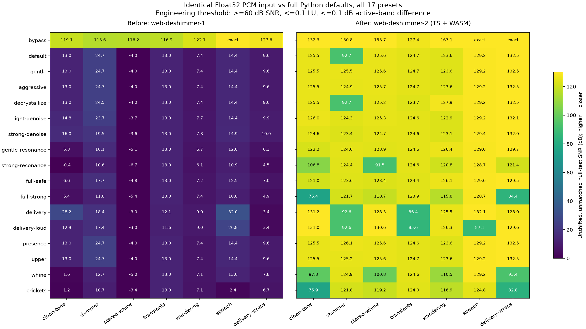

# deshimmer 等价输出修复报告

> 本文保存 v2 的等价输出基线。当前 v3 优化及复验结果见 [性能优化报告](remaster-optimization.zh-CN.md)。

日期：2026-10-07。分支：`codex/web-deshimmer`。引擎：`web-deshimmer-2`。

**完整 Python 默认处理链的 187/187 组对照达到原定数值容差。** 覆盖 17 个预设和 11 个输入，其中 155/187 组最大 PCM 差不超过 2 个 PCM24 量化单位。非零残差的最差 SNR 为 **75.36 dB**；最大响度差 **0.00042640 LU**，最大有效频段差 **0.00063324 dB**。有信号通道的测得时差均为 0 样本，采样率、长度、通道数一致，输出全部有限。

结论是**固定参考版本和测试范围内，工程容差意义上的等价输出**。155 组“PCM 一致”也允许 2 个量化单位的差，并不等于所有 WAV 逐字节相同。独立比较真实 Worker 和 Node 实现的 51 组 WAV 则全部逐字节相同。

## 修复内容

v1 的问题不只是公式误差：它省略了参考默认链的多个阶段，又用因果近似替代部分离线统计。因此本次补齐默认链，而不是关闭 Python 功能来迁就 Web 输出。

| 部分 | 修复后的行为 |
| --- | --- |
| 预设 | 补齐 noise PSD 平滑、共振频率平滑和持续性阈值；修正 full-strong 参数及 whine 的 stationary-floor 开关。17 个配方均从全新 UI 默认值构建，映射参数差异为零。 |
| 声道处理 | 全局相关性延迟判断、3 ms 接受范围、声道频谱平衡及边界裁切。 |
| 频谱修复 | 离线分块最小统计、零初始化 PSD EMA、决策导向 Wiener；共振使用参考的幅度 inpainting，含居中时间底层滤波、持续性和密度保护。 |
| 默认补全 | Bark/ATH 掩蔽、前向时间掩蔽、Dynamic Spectral Carver、三轮 STFT projection，以及默认强度 0.5 的谐波轨迹修复。 |
| 随机重合成 | NumPy seed 0 的 PCG64 和频率优先的随机序列顺序，避免用另一随机序列制造音色差异。 |
| 数值精度 | STFT 保持 Float32 Hann 窗、由 SciPy 补零触发的 Float64 输入运算、Float32 输出累计；修复混合精度与平衡统计。小型 WASM FFT 使用固定 SciPy 版本的 ducc 实数内核。 |
| Delivery | 参考的 RBJ K-weighting、DC 去除、20 Hz sosfiltfilt、4× FIR 重采样、联动 PDR limiter 和实际峰值窗口行为；去除 v1 额外母带保护增益。 |
| WAV | 与 libsndfile 一致的 floor(sample × 8388608)、饱和与 PCM24 编码。 |

谐波修复包含峰值插值、Hungarian 轨迹匹配、谐波族判断、置信度门限和连续相位修正。没有引入 Python 运行时，也没有将音频上传到服务器。

## 对照方法

参考为干净、未改动的 [deshimmer checkout](https://github.com/TheApeMachine/deshimmer/tree/fea2cca81da613ec8a3aca4962a359e060eab9d9)，SHA `fea2cca81da613ec8a3aca4962a359e060eab9d9`。Python 3.14.5、NumPy 2.5.3、SciPy 1.18.1、SoundFile 0.14.0、pyloudnorm 0.2.0；未启用可选 Numba。SciPy FFT 内核固定到 `e4e854eaa8f18d807cd3496028e257e36caa93cc`。

两端读取同一份 little-endian Float32 PCM，避免解码器和重采样器的差异。Python 使用全新 UI 默认值加预设更新，保留 enhance、tonal repair、projection 和交付处理；两端均写 PCM24 WAV，再统一读取测量。没有对输出做时移或增益匹配。响度差使用同一个 pyloudnorm DeMan 测量器，4× 峰值使用同一 SciPy 估计器。

验收条件沿用修复前标准，未放宽：

- 最大样本误差 ≤ `2 / 8388608`；或
- 残差 SNR ≥60 dB、响度差 ≤0.1 LU、参考能量高于 −80 dB 的有效频段差 ≤0.1 dB。

静音不定义 SNR，以 PCM 差判定。全部静音对照通过。`repair-only` 和阶段消融仍作为诊断数据保存在本地，**本报告仅以完整默认链 full 结果验收**。

原有 8 个输入覆盖静音、纯音、shimmer 噪声、延迟且音量不同的立体声 whine、瞬态和反相声道、游移谐波、实际朗读语音、DC 和高峰值交付压力。新增 8 kHz 单声道 2.137 秒、96 kHz 立体声 3.017 秒、48 kHz 立体声 20.013 秒，均非 hop 整数倍。合成输入使用固定随机种子；SHA-256、精确参数、源文件哈希与完整测量见 [冻结证据](remaster-equivalence-results.json)。

## 各预设结果

| 预设 | 达到容差 | PCM ≤2 量化单位 | 最差非空 SNR / dB |
| --- | --- | --- | --- |
| bypass | 11/11 | 11/11 | 127.38 |
| default | 11/11 | 10/11 | 92.73 |
| gentle | 11/11 | 11/11 | 123.19 |
| aggressive | 11/11 | 11/11 | 123.19 |
| decrystallize | 11/11 | 9/11 | 92.70 |
| light-denoise | 11/11 | 9/11 | 107.83 |
| strong-denoise | 11/11 | 11/11 | 122.86 |
| gentle-resonance | 11/11 | 10/11 | 121.55 |
| strong-resonance | 11/11 | 7/11 | 91.53 |
| full-safe | 11/11 | 9/11 | 103.33 |
| full-strong | 11/11 | 8/11 | 75.36 |
| delivery | 11/11 | 7/11 | 86.42 |
| delivery-loud | 11/11 | 5/11 | 85.60 |
| presence | 11/11 | 11/11 | 123.19 |
| upper | 11/11 | 11/11 | 123.23 |
| whine | 11/11 | 7/11 | 93.35 |
| crickets | 11/11 | 8/11 | 75.91 |

最大样本差仍出现在 shimmer / delivery-loud，约 0.00010514；该例依靠上述 SNR、响度和频段条件通过，不属于 PCM ≤2 量化单位的组。



图表使用原始 7 个非静音输入，便于与冻结的 v1 基线比较。SNR 越高残差越小；`exact` 表示该组 WAV 解码后的样本完全一致，颜色在 130 dB 饱和。扩展输入的测量保存在上面的表格和 JSON 中。

## 回归与应用内验证

- `npm run check`：lint、类型检查、生产构建及 **73 项测试全部通过**。新增独立 Python golden fixtures：4 个完整输入、8 个关键输入/预设组合，保存输入哈希、4096 个参考 PCM24 采样点和整体 RMS。它们由未改动的 Python 输出生成，普通测试不依赖 Python。
- PCG64 序列与 jump-ahead 使用 NumPy 的独立参考值。
- 已编译的真实浏览器 Worker：shimmer、stereo-whine、delivery-stress ×17 预设，**51/51 与 Node WAV SHA-256 相同**。因此数值结论包含生产 Worker，而非仅 Node 测试入口。
- 300 秒立体声应用内验证：保持 A、同步 A/B、PCM24 下载、错误/取消保留 B、切歌与手动 B 替换取消、OPFS 缓存恢复、缓存失败回退与清理均通过。

Apple M2 Max / macOS 27.0.1 / Electron 43.3.0，44.1 kHz 解码、full-safe：300 秒合成音乐＋噪声的处理和 WAV 写出耗时 **68.99 秒**，约 **4.35 倍实时速度**。主线程 16 ms 定时器最大间隔 **28.2 ms**。处理耗时不含 B 解码和缓存；定时器结果不代表完整 UI 或播放无掉帧认证。

## 资源与适用范围

TypeScript 主逻辑在 Worker 中执行，小型 WASM FFT 为 174,385 字节，gzip 约 53.4 KB，线性内存固定 2 MiB。普通 npm 构建直接打包已提交的二进制，维护者可按 [FFT 内核说明](../src/audio/remaster/wasm/README.md) 重编译。第三方声明随构建发布。

为保留离线算法，需要完整 PCM 和多次扫描；通过重算频谱避免保存整曲 STFT，通过环形缓冲避免整曲 4× 过采样。完整 PCM、新旧 B、WAV 和浏览器解码副本仍会增加峰值内存。输入限于 mono/stereo、8–96 kHz、12 分钟和 128 MiB 解码 PCM，两个长度/体积条件同时满足。谐波轨迹最多 500,000 个观测点，超限明确提示缩短片段，不会跳过修复。Delivery 需要超过 9 个样本以执行参考高通滤波。

未覆盖真实歌曲盲听、移动端内存压力、所有浏览器及其他 Python 依赖版本，也不保证任意输入逐字节一致。Python UI 的历史参数继承状态不在对照范围内，产品预设始终独立。数值等价验证与音质偏好判断是两件事。

## 复现

首次准备干净参考 checkout 和隔离的开发依赖：

```sh
git clone https://github.com/TheApeMachine/deshimmer .cache/deshimmer-reference
git -C .cache/deshimmer-reference checkout fea2cca81da613ec8a3aca4962a359e060eab9d9
python3.14 -m venv .cache/remaster-parity-venv
.cache/remaster-parity-venv/bin/python -m pip install -r scripts/remaster-parity-requirements.txt
```

重跑完整数值矩阵及生产 Worker 检查：

```sh
.cache/remaster-parity-venv/bin/python scripts/compare-remaster.py --upstream .cache/deshimmer-reference --output outputs/remaster-equivalence --extended
npm run build
node_modules/.bin/electron scripts/check-remaster-worker-parity.mjs outputs/remaster-equivalence
.cache/remaster-parity-venv/bin/python scripts/plot-remaster-equivalence.py
```

单独复算测量可加 `--phase report`，不重新处理音频。运行证据和 WAV 在忽略的 `outputs/remaster-equivalence/`；提交的 JSON 与 golden fixtures 保留本次基线。旧 [v1 对照](remaster-consistency.zh-CN.md) 保持为历史记录。
